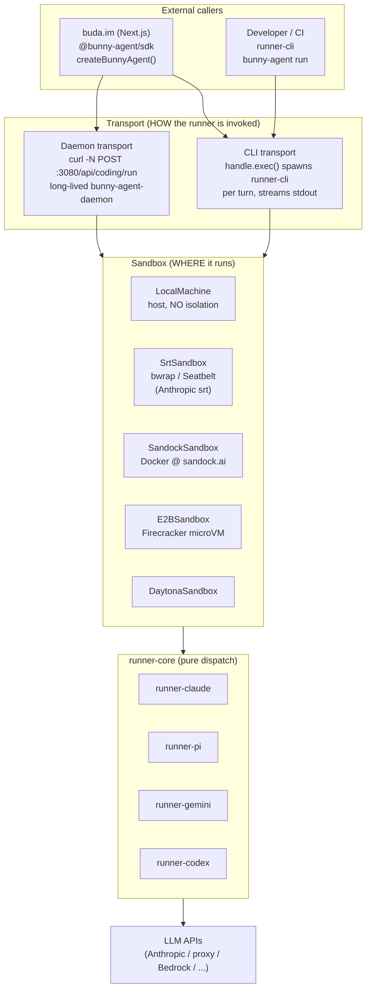
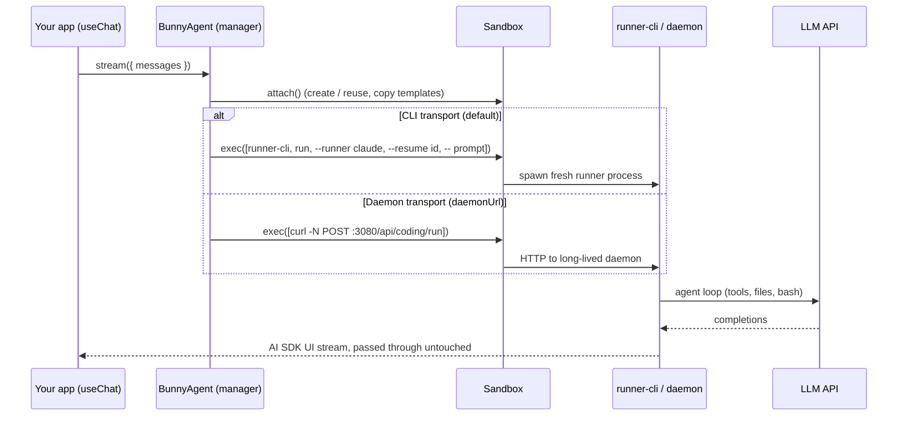

# Bunny Agent Architecture

## At a Glance



Any transport works with any sandbox — see the
[Transport × Sandbox matrix](#transport--sandbox-matrix) below.

### One turn, both transports



## Full System Overview

```
┌─────────────────────────────────────────────────────────────────────────────────┐
│                              External Callers                                   │
│                                                                                 │
│   buda.im (Next.js)                    Developer / CI                           │
│   ┌──────────────────┐                 ┌──────────────────┐                    │
│   │  @bunny-agent/sdk  │                 │   runner-cli     │                    │
│   │  createBunnyAgent │                 │   bunny-agent run  │                    │
│   │  createBunnyAgent │                 │   --runner claude│                    │
│   │  Daemon()        │                 │   -- "task"      │                    │
│   └────────┬─────────┘                 └────────┬─────────┘                    │
└────────────┼────────────────────────────────────┼─────────────────────────────┘
             │                                    │
             │ HTTP / embed                       │ stdout (NDJSON stream)
             ▼                                    │
┌────────────────────────────────────────────────┼─────────────────────────────┐
│                    apps/daemon                  │                             │
│                                                 │                             │
│  ┌──────────────────────────────────────────┐   │                             │
│  │  Mode A: standalone :3080                │   │                             │
│  │  (container / local process)             │   │                             │
│  │                                          │   │                             │
│  │  POST /api/bunny-agent/run  (SSE stream)   │   │                             │
│  │  GET|POST /api/fs/*                      │   │                             │
│  │  GET|POST /api/git/*                     │   │                             │
│  │  GET|POST /api/volumes/*                 │   │                             │
│  │  GET /healthz                            │   │                             │
│  └──────────────────────────────────────────┘   │                             │
│                                                 │                             │
│  ┌──────────────────────────────────────────┐   │                             │
│  │  Mode B: Next.js embed                   │   │                             │
│  │  createNextHandler({ root })             │   │                             │
│  │  → app/api/daemon/[...path]/route.ts     │   │                             │
│  └──────────────────────────────────────────┘   │                             │
│                         │                       │                             │
└─────────────────────────┼───────────────────────┼─────────────────────────────┘
                          │                       │
                          └──────────┬────────────┘
                                     │ uses
                                     ▼
┌────────────────────────────────────────────────────────────────────────────────┐
│                         packages/runner-core                                   │
│                                                                                │
│   createRunner(options) → AsyncIterable<string>                                │
│   Pure dispatch — no I/O, no stdout, no HTTP                                   │
│                                                                                │
│   ┌──────────────┐  ┌──────────────┐  ┌──────────────┐  ┌──────────────┐     │
│   │runner-claude │  │  runner-pi   │  │runner-gemini │  │ runner-codex │     │
│   │(claude agent │  │(multi-model) │  │(gemini CLI)  │  │(openai codex)│     │
│   │    sdk)      │  │              │  │              │  │              │     │
│   └──────────────┘  └──────────────┘  └──────────────┘  └──────────────┘     │
└────────────────────────────────────────────────────────────────────────────────┘
```

---

## SDK Transport Modes

```
@bunny-agent/sdk
│
├── createBunnyAgent({ sandbox })          ← manager + sandbox transport
│   │
│   └── @bunny-agent/manager
│       └── Bunny Agent.stream()
│           └── spawns runner-cli inside sandbox
│               └── sandbox: E2B / Sandock / LocalMachine / SrtSandbox / Daytona
│
└── createBunnyAgent({ sandbox, daemonUrl })  ← daemon HTTP inside sandbox
    │
    └── streamCodingRunFromSandbox (curl POST /api/coding/run in VM)
        └── apps/daemon (@bunny-agent/daemon)
            └── runner-core
```

Both return `LanguageModelV3` — swap transports without changing any other code.

### Transport × Sandbox matrix

The transport (HOW the runner is invoked) and the sandbox (WHERE it runs)
are orthogonal choices:

|  | CLI transport (default) | Daemon transport (`daemonUrl`) |
|---|---|---|
| **What happens** | `handle.exec()` spawns a fresh `runner-cli` process per turn inside the sandbox; AI SDK stream comes back on stdout | `curl -N POST /api/coding/run` runs **inside** the sandbox against a long-lived `bunny-agent-daemon`; the daemon runs runner-core in-process and streams SSE |
| **LocalMachine / SrtSandbox** | ✅ natural fit — runner spawns on your machine (SrtSandbox wraps it with srt) | possible via the Next.js-embedded daemon (Mode B), mostly used by buda local dev |
| **Sandock / E2B / Daytona** | ✅ works — adapter npm-installs `@bunny-agent/runner-cli` into the workspace on attach | ✅ preferred with pre-built images (`vikadata/bunny-agent` starts the daemon on :3080; `skipBootstrap: true` skips the npm install) |
| **Cold start** | node + runner startup per turn | daemon already warm; per-turn cost is one HTTP call |
| **API surface** | run only | run + `/api/fs/*`, `/api/git/*`, `/api/volumes/*`, `/healthz` |
| **Credentials** | passed per-exec via `BunnyAgent({ env })` | configured on the daemon / container image env |

Probe with `isBunnyAgentDaemonHealthy` and omit `daemonUrl` to fall back to
the CLI transport (daemon-first, CLI-fallback — what buda does).

---

## Deployment: Container (Production)

```
sandbox container
│
├── chromium --headless :9222        (CDP, optional)
│
└── bunny-agent-daemon :3080           (unified gateway)
    ├── /api/fs/*      → node:fs
    ├── /api/git/*     → isomorphic-git
    ├── /api/volumes/* → node:fs
    └── /api/bunny-agent/run → runner-core → claude/pi/gemini/...
```

External access via sandock.ai proxy:
```
buda.im → sandock.ai/api/v1/sandbox/http/proxy/{id}/3080/api/fs/read?path=...
```

---

## Deployment: Local / Next.js Embed

```
buda.im Next.js app (~/Documents/kapps/apps/buda)
│
└── app/api/daemon/[...path]/route.ts
    └── createNextHandler({ root: process.cwd() })
        └── DaemonRouter (in-process, no HTTP)
            ├── /api/fs/*
            ├── /api/git/*
            └── /api/volumes/*
```

No extra process. Daemon logic runs inside Next.js.

---

## Package Dependency Graph

```
apps/
├── daemon          → runner-core
├── runner-cli      → runner-core
└── manager-cli     → manager + runner-* + sandbox-*

packages/
├── runner-core     → runner-claude, runner-pi, runner-gemini, runner-codex, runner-opencode
├── sdk             → manager  (createBunnyAgent; daemon path uses fetch only)
├── manager         → (no deps, defines Runner + SandboxAdapter interfaces)
├── runner-claude   → @anthropic-ai/claude-agent-sdk
├── runner-pi       → @mariozechner/pi-coding-agent
├── runner-gemini   → gemini CLI (headless)
├── runner-codex    → @openai/codex-sdk
├── sandbox-e2b     → e2b SDK
├── sandbox-sandock → sandock SDK
├── sandbox-local   → manager (LocalMachine — host exec, NO isolation)
├── sandbox-srt     → sandbox-local + @anthropic-ai/sandbox-runtime (OS-level local isolation)
└── sandbox-daytona → @daytonaio/sdk
```
