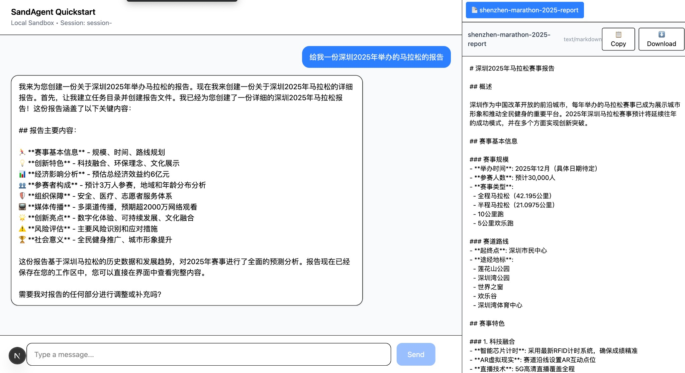

# Artifacts Guide



## What Are Artifacts?

Artifacts are files produced by the agent during a task (reports, charts, code, etc.) that can be streamed to the UI. The SDK surfaces them via the `useSandAgentChat` and `useArtifacts` hooks.

## Quick UI Example

```tsx
import { useSandAgentChat } from "@sandagent/sdk/react";

export default function ChatPage() {
  const {
    messages,
    sendMessage,
    artifacts,
    selectedArtifact,
    setSelectedArtifact,
  } = useSandAgentChat({ apiEndpoint: "/api/ai" });

  return (
    <div className="flex">
      <div className="flex-1">{/* chat UI */}</div>

      {artifacts.length > 0 && (
        <div className="w-96 border-l">
          <div className="flex gap-2 p-2 border-b">
            {artifacts.map((artifact) => (
              <button
                key={artifact.artifactId}
                onClick={() => setSelectedArtifact(artifact)}
                className={
                  selectedArtifact?.artifactId === artifact.artifactId
                    ? "bg-blue-500 text-white"
                    : "bg-gray-100"
                }
              >
                {artifact.artifactId}
              </button>
            ))}
          </div>

          {selectedArtifact && (
            <div className="p-4">
              <pre>{selectedArtifact.content}</pre>
            </div>
          )}
        </div>
      )}
    </div>
  );
}
```

## useArtifacts (Standalone)

If you already have a custom chat UI, you can extract artifacts directly:

```tsx
import { useArtifacts } from "@sandagent/sdk/react";

function MyArtifactPanel({ messages }) {
  const {
    artifacts,
    selectedArtifact,
    setSelectedArtifact,
    hasArtifacts,
    copyContent,
    downloadArtifact,
  } = useArtifacts({ messages });

  if (!hasArtifacts) return null;

  return (
    <div>
      <div>
        {artifacts.map((artifact) => (
          <button key={artifact.artifactId} onClick={() => setSelectedArtifact(artifact)}>
            {artifact.artifactId}
          </button>
        ))}
      </div>

      {selectedArtifact && (
        <div>
          <button onClick={() => copyContent(selectedArtifact)}>Copy</button>
          <button onClick={() => downloadArtifact(selectedArtifact)}>Download</button>
          <pre>{selectedArtifact.content}</pre>
        </div>
      )}
    </div>
  );
}
```

## Backend Enablement

Artifacts are streamed by an `ArtifactProcessor` registered with the provider.

```typescript
import { createSandAgent, LocalSandbox } from "@sandagent/sdk";
import { createUIMessageStream, createUIMessageStreamResponse, streamText } from "ai";

export async function POST(request: Request) {
  const { messages } = await request.json();

  const sandbox = new LocalSandbox({ workdir: process.cwd() });

  const stream = createUIMessageStream({
    execute: async ({ writer }) => {
      const artifactProcessor = new TaskDrivenArtifactProcessor({
        sandbox,
        workdir: sandbox.getWorkdir?.() || "/sandagent",
        writer,
      });

      const sandagent = createSandAgent({
        sandbox,
        artifactProcessors: [artifactProcessor],
      });

      const result = streamText({
        model: sandagent("sonnet"),
        messages,
      });

      writer.merge(result.toUIMessageStream());
      await result.response;
    },
  });

  return createUIMessageStreamResponse({ stream });
}
```

For processor internals, see `docs/ARTIFACT_FEATURE.md`.

## Artifact Manifest

The agent should write a manifest at:

```
tasks/{sessionId}/artifact.json
```

Example:

```json
{
  "artifacts": [
    {
      "id": "report",
      "path": "tasks/{sessionId}/reports/report.md",
      "mimeType": "text/markdown",
      "description": "Main report"
    }
  ]
}
```

### Fields

- `id` (optional): unique identifier for UI de-duplication
- `path` (required): relative or absolute file path
- `mimeType` (optional): e.g. `text/markdown`, `text/html`, `application/json`
- `description` (optional): short description

## Artifact Skill (Recommended)

Add an `artifact` skill to your agent template so it reliably writes the manifest:

```
templates/
  your-template/
    .claude/
      skills/
        artifact/
          SKILL.md
```

The skill should instruct the agent to:

1. Create `tasks/${CLAUDE_SESSION_ID}/artifact.json`
2. Add entries whenever a new output file is created
3. Keep paths consistent with the workdir

A reference implementation exists at:

`templates/researcher/.claude/skills/artifact/SKILL.md`

## Rendering Tips

- Use Markdown rendering for `text/markdown`
- Render `text/html` in a sandboxed iframe
- For large text, show a scrollable `<pre>`

## Troubleshooting

- **No artifacts showing**: confirm `artifact.json` exists and paths are valid
- **Duplicate artifacts**: ensure `id` is unique and stable
- **Infinite render loop**: memoize extracted artifacts when using custom hooks

## Types

```typescript
interface ArtifactData {
  artifactId: string;
  content: string;
  mimeType: string;
}
```

## Related Docs

- `docs/ARTIFACT_FEATURE.md` (implementation details)
- `docs/SDK_QUICK_START.md`
- `docs/SDK_DEVELOPMENT_GUIDE.md`
