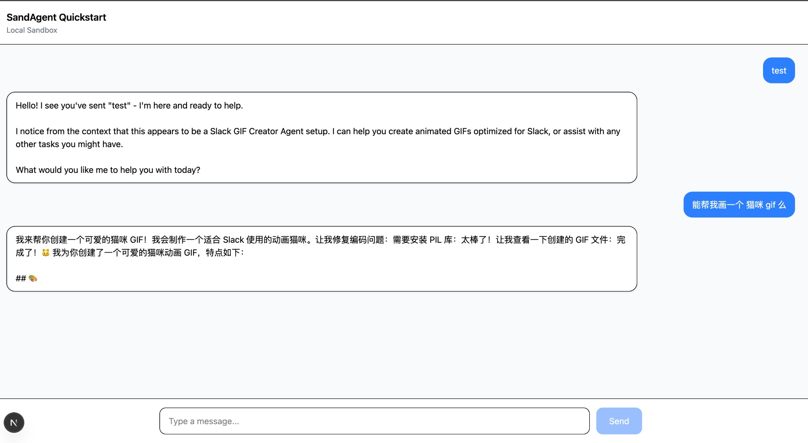

# SandAgent Quick Start

Add an AI agent chat to your project in about 5 minutes.



## Install

```bash
npm install @sandagent/sdk ai
```

## Usage

### 1. Create the Backend API

Create `app/api/ai/route.ts` (Next.js App Router):

```typescript
import { createSandAgent, LocalSandbox } from "@sandagent/sdk";
import { convertToModelMessages, createUIMessageStream, createUIMessageStreamResponse, streamText } from "ai";

export async function POST(request: Request) {
  const { messages } = await request.json();

  const env: Record<string, string> = {};
  if (process.env.ANTHROPIC_API_KEY) {
    env.ANTHROPIC_API_KEY = process.env.ANTHROPIC_API_KEY;
  }
  if (process.env.AWS_BEARER_TOKEN_BEDROCK) {
    env.AWS_BEARER_TOKEN_BEDROCK = process.env.AWS_BEARER_TOKEN_BEDROCK;
    env.CLAUDE_CODE_USE_BEDROCK = "1";
  }

  const sandbox = new LocalSandbox({
    workdir: process.cwd(),
    templatesPath: process.cwd(),
    runnerCommand: ["npx", "-y", "@sandagent/runner-cli@latest", "run"],
    env,
  });

  const stream = createUIMessageStream({
    execute: async ({ writer }) => {
      const sandagent = createSandAgent({ sandbox, cwd: sandbox.getWorkdir() });
      const result = streamText({
        model: sandagent("sonnet"),
        messages: await convertToModelMessages(messages),
        abortSignal: request.signal,
      });
      writer.merge(result.toUIMessageStream());
    },
  });

  return createUIMessageStreamResponse({ stream });
}
```

### 2. Create the Chat Page

Create `app/page.tsx`:

```tsx
"use client";

import { useSandAgentChat } from "@sandagent/sdk/react";
import { useState } from "react";

export default function ChatPage() {
  const [input, setInput] = useState("");
  const { messages, isLoading, sendMessage } = useSandAgentChat({
    apiEndpoint: "/api/ai",
  });

  const handleSubmit = (e: React.FormEvent) => {
    e.preventDefault();
    if (!input.trim()) return;
    sendMessage(input);
    setInput("");
  };

  return (
    <div className="h-screen flex flex-col">
      <div className="flex-1 overflow-y-auto p-4 space-y-4">
        {messages.map((msg) => (
          <div key={msg.id} className={msg.role === "user" ? "text-right" : ""}>
            <div className={`inline-block p-3 rounded-lg ${
              msg.role === "user" ? "bg-blue-500 text-white" : "bg-gray-100"
            }`}>
              {msg.parts.map((part, i) => part.type === "text" && <span key={i}>{part.text}</span>)}
            </div>
          </div>
        ))}
        {isLoading && <div className="text-gray-500">Thinking...</div>}
      </div>

      <form onSubmit={handleSubmit} className="p-4 border-t flex gap-2">
        <input
          value={input}
          onChange={(e) => setInput(e.target.value)}
          placeholder="Type a message..."
          className="flex-1 px-4 py-2 border rounded-lg"
        />
        <button type="submit" disabled={isLoading} className="px-4 py-2 bg-blue-500 text-white rounded-lg">
          Send
        </button>
      </form>
    </div>
  );
}
```

### 3. Set Environment Variables

**Anthropic API (recommended):**

```
ANTHROPIC_API_KEY=sk-ant-xxx
```

**AWS Bedrock:**

```
AWS_BEARER_TOKEN_BEDROCK=xxx
```

### 4. Start the App

```bash
npm run dev
```

---

## Customize Agent Behavior

Create `CLAUDE.md` in your template directory:

```markdown
# My AI Assistant

You are a helpful assistant that answers questions and writes code.
```

**Template structure:**

```
my-agent-template/
├── CLAUDE.md
└── .claude/
    └── skills/
        └── my-skill/
            └── SKILL.md
```

`templatesPath` tells `LocalSandbox` to copy the template files into the workdir.

---

## Other Frameworks

The same core logic works for Express, Fastify, Koa, etc.:

```typescript
const sandbox = new LocalSandbox({
  workdir: process.cwd(),
  templatesPath: process.cwd(),
  runnerCommand: ["npx", "-y", "@sandagent/runner-cli@latest", "run"],
  env: { ANTHROPIC_API_KEY },
});

const sandagent = createSandAgent({ sandbox });

const result = streamText({
  model: sandagent("sonnet"),
  messages,
});
```

---

## Artifacts (Files in the UI)

Artifacts let the agent stream files (reports, charts, code) into the UI. See:

- `docs/SDK_ARTIFACTS_GUIDE.md`

---

## Next Steps

- `docs/SDK_ARTIFACTS_GUIDE.md`
- `docs/SDK_DEVELOPMENT_GUIDE.md`
- `spec/API_REFERENCE.md`
- `apps/sandagent-quickstart`
- `packages/sandbox-e2b/README.md`
