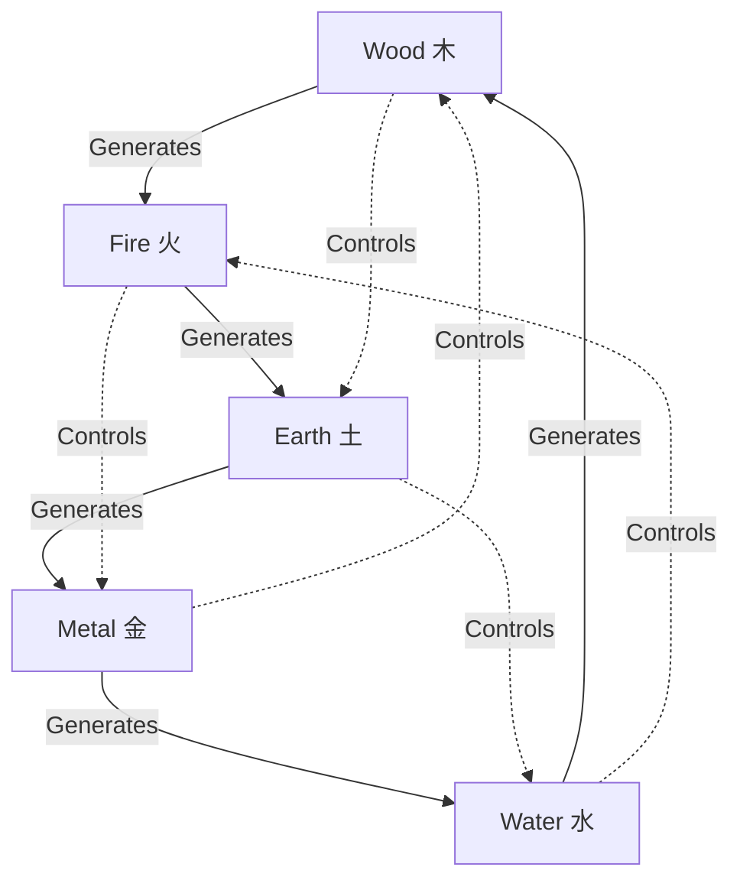

# Chart Visualizer

This skill creates beautiful, informative visual representations of BaZi analysis. It transforms complex astrological data into clear, engaging charts and diagrams that enhance understanding and retention.

## When to Use This Skill

- **After BaZi calculation**: Create visual chart display
- **Consultation reports**: Professional presentation
- **Client sharing**: Exportable graphics for users
- **Educational purposes**: Teaching BaZi concepts
- **Social sharing**: Shareable fortune insights (with permission)

## What This Skill Does

1. **Four Pillars Display**: Creates traditional Four Pillars chart with stems/branches
2. **Elements Radar Chart**: Visualizes Five Elements balance distribution
3. **Luck Cycle Timeline**: Shows 10-year cycles across lifespan
4. **Relationship Diagram**: Illustrates element generating/controlling relationships
5. **Annual Forecast Calendar**: Visualizes yearly influences
6. **Comprehensive Report**: Combines all visualizations into cohesive document

## Visualization Types

### 1. Four Pillars Chart (四柱图)

Traditional vertical display with:
- Heavenly Stems (天干) on top
- Earthly Branches (地支) on bottom
- Element colors
- Hidden Stems notation
- Day Master highlight

```
┌─────────────────────────────────────┐
│       八字命盘 (BaZi Chart)          │
│                                     │
│  Year   Month    Day    Hour       │
│  年柱   月柱     日柱   时柱         │
├────────────────────────────────────┤
│  己     丁      甲★    癸           │
│ Earth  Fire    Wood   Water        │
│  土     火      木     水           │
├────────────────────────────────────┤
│  巳     丑      子     酉           │
│ Fire   Earth   Water  Metal        │
│  火     土      水     金           │
└────────────────────────────────────┘

★ Day Master (日主): 甲木 Yang Wood
```

### 2. Five Elements Radar Chart (五行雷达图)

Pentagon showing elemental balance:

```
          Wood (木)
              ★
             /|\
            / | \
           /  |  \
          /   |   \
    Water ----★---- Fire
    (水)     |      (火)
         \   |   /
          \  |  /
           \ | /
            \|/
      Metal--★--Earth
      (金)      (土)

Distribution:
木 Wood:  20%
火 Fire:  25%
土 Earth: 15%
金 Metal: 30%
水 Water: 10%
```

### 3. Luck Cycle Timeline (大运时间线)

Horizontal timeline showing 10-year cycles:

```
Age:   3      13      23      33      43      53      63
       │       │       │       │       │       │       │
Cycle: 戊寅   己卯    庚辰    辛巳    壬午    癸未    甲申
       │Wood+ │Wood++ │Earth+ │Fire++ │Fire+++│Earth++│Metal+│
       │       │       │       │       │▲      │       │
       └───────┴───────┴───────┴───────┴───────┴───────┘
                                    Current: 2026
                                    Fire Cycle (High Energy)

Legend:
+ : Moderate influence
++ : Strong influence
+++: Peak influence
```

### 4. Element Relationship Diagram (五行关系图)

Shows generating and controlling cycles:

```
                 Fire 🔥
                   ↑
                  生|
                   |
      Wood 🌳 ────→ Earth ⛰️
         ↑             ↓
        生|           生|
         |             |
      Water 💧 ←──── Metal ⚡
                  生

Legend:
→ : 相生 (Generates)
⤬ : 相克 (Controls) - shown with dashed lines
```

### 5. Annual Forecast Wheel (流年轮盘)

Current year influences:

```
           2026 - Year of 丙午
             Fire Horse Year

      ┌─────────────────────┐
      │  Spring   |  Summer │
      │  木旺      |  火旺    │
      ├───────────┼─────────┤
      │  Winter   |  Autumn │
      │  水旺      |  金旺    │
      └───────────┴─────────┘

Favorable Months: Feb, May, Nov
Challenging Months: Aug (excessive Fire)
Opportunities: March-June (growth period)
```

## Output Formats

### 1. Text-Based (ASCII Art)
For terminal display and plain text documents:
- Unicode box drawing characters
- ASCII art representations
- Text-based charts and tables
- Emoji for visual interest

### 2. Markdown (for Web)
For web display and documentation:
- Mermaid diagrams
- HTML tables
- Markdown formatting
- Embedded emoji and symbols

### 3. SVG/PNG (Exportable Graphics)
For professional reports:
- Vector graphics (scalable)
- Traditional colors (五行色)
- Printable quality
- Shareable images

### 4. PDF Report
Comprehensive document:
- Cover page with name/date
- All visualizations integrated
- Narrative text + graphics
- Professional layout

## Design System: "Neo-Zen"

### Color Palette

**Element Colors** (Traditional):
- 🌳 Wood: `#2D5016` (forest green)
- 🔥 Fire: `#E63946` (cinnabar red)
- ⛰️ Earth: `#D4A574` (earthy gold)
- ⚡ Metal: `#C0C0C0` (silver)
- 💧 Water: `#1B263B` (deep blue)

**Background**:
- Primary: `#FAFAFA` (light mode), `#0F0F0F` (dark mode)
- Card: `#FFFFFF` (light), `#1A1A1A` (dark)

**Accent**:
- Highlight: `#E63946` (red)
- Success: `#06D6A0` (jade green)
- Warning: `#FFB703` (gold)

### Typography

**Chinese Characters**: Noto Serif SC (traditional feel)
**English Text**: Inter (modern readability)
**Data/Numbers**: JetBrains Mono (technical precision)

### Visual Elements

- **Borders**: 1-2px solid, element colors
- **Shadows**: Subtle, soft (not harsh)
- **Spacing**: Generous whitespace
- **Icons**: Minimal, line-based
- **Emphasis**: Color + weight, not size

## Usage Examples

### Basic Chart Visualization

```
User: "Create a visual chart for my BaZi"

Agent: I'll create a comprehensive visual representation of your BaZi chart.

[Generates]:
1. Four Pillars display
2. Elements radar chart
3. Current luck cycle position
4. Element relationship diagram

[Saves to]: ./output/charts/[name]-visual-[date].md
```

### Compatibility Visual

```
User: "Show us a visual comparison of our compatibility"

Agent: I'll create a side-by-side visual comparison showing how your 
charts interact.

[Generates]:
1. Both Four Pillars side-by-side
2. Overlaid element radar charts
3. Compatibility score wheel
4. Relationship dynamic diagram

[Saves to]: ./output/consultations/[nameA-nameB]-compatibility-visual-[date].md
```

### Luck Cycle Animation

```
User: "Show me my luck cycles over time"

Agent: I'll create a timeline showing your 10-year luck cycles from birth 
to age 80, highlighting your current position and upcoming transitions.

[Generates]:
1. Full lifetime timeline
2. Current position marker
3. Element strength indicators
4. Transition period highlights

[Saves to]: ./output/charts/[name]-luck-timeline-[date].md
```

## Technical Implementation

### ASCII Art Generation

```bash
# Box drawing characters
┌─┬─┐ ╔═╦═╗ ╭─┬─╮
├─┼─┤ ╠═╬═╣ ├─┼─┤
└─┴─┘ ╚═╩═╝ ╰─┴─╯

# Arrows and symbols
→ ← ↑ ↓ ↔ ↕ ⇒ ⇐ ⇑ ⇓
★ ☆ ● ○ ◆ ◇ ■ □ ▲ △

# Charts
█ ▓ ▒ ░ ─ │ ┼ ╱ ╲
```

### Mermaid Diagrams

```markdown

```

### Data Visualization (Python/JS)

For PNG/SVG generation:
```python
# Radar chart for elements
import matplotlib.pyplot as plt
import numpy as np

elements = ['Wood', 'Fire', 'Earth', 'Metal', 'Water']
values = [20, 25, 15, 30, 10]  # Percentages

# Create radar chart...
```

## Best Practices

### Visual Clarity
- ✅ Use consistent element colors throughout
- ✅ Label all chart axes and sections clearly
- ✅ Include legends for symbols/colors
- ✅ Maintain high contrast for readability
- ✅ Use whitespace generously

### Cultural Respect
- ✅ Use traditional Chinese characters where appropriate
- ✅ Include pinyin for accessibility
- ✅ Respect traditional color associations
- ✅ Balance modern design with classical elements
- ✅ Acknowledge cultural significance

### Accessibility
- ✅ Text alternatives for visual charts
- ✅ Color + pattern (not just color alone)
- ✅ Readable font sizes (12pt minimum)
- ✅ High contrast ratios
- ✅ Screen reader friendly

### Professional Quality
- ✅ Clean, uncluttered layouts
- ✅ Consistent styling across all visuals
- ✅ Print-ready resolution (300dpi for images)
- ✅ Shareable formats (PNG, PDF, SVG)
- ✅ Watermark/branding (if applicable)

## Output Files

### Standard Outputs

```
./output/charts/
├── [name]-four-pillars-[date].txt      # ASCII art chart
├── [name]-elements-radar-[date].svg    # Element chart
├── [name]-luck-timeline-[date].png     # Timeline graphic
├── [name]-full-report-[date].pdf       # Complete PDF
└── [name]-visual-report-[date].md      # Markdown with all visuals
```

### Shareable Versions

```
./output/social/
├── [name]-chart-card-[date].png        # Social media size (1200x630)
├── [name]-elements-share-[date].png    # Square format (1080x1080)
└── [name]-insight-quote-[date].png     # Quote card with visual
```

## Integration

Visualization integrates with:
- **calculate-bazi**: Auto-generate chart after calculation
- **five-elements-balance**: Create radar chart from analysis
- **luck-cycle-forecast**: Generate timeline visualization
- **relationship-compatibility**: Side-by-side comparison
- **consultation-report**: Embed all visuals in final report

## Examples

### Minimal Chart (Text)

```
八字: 己巳 丁丑 甲子 癸酉
日主: 甲木 (Yang Wood)

Elements: 木█ 火██ 土███ 金██ 水███
Balance: Earth & Water strong, Wood weak
```

### Full Professional Report

[See example report in documentation with:
- Cover page with name and date
- Four Pillars visualization
- Elements radar chart
- Luck cycle timeline
- Key insights with icons
- Recommendations section
- Footer with disclaimer]

---

**Design Principle**: "形简意赅，雅而不俗" - Simple in form, profound in meaning, elegant without vulgarity. Visualizations should clarify, not complicate.
